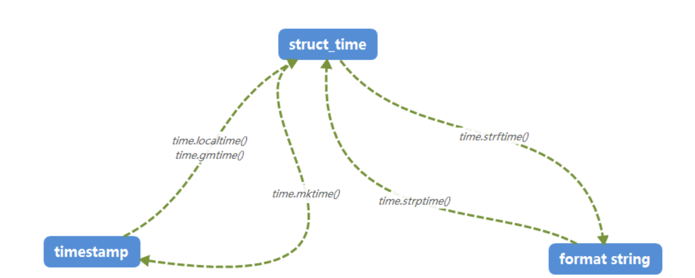

### 时间戳格式转化

> 时间转化为时间戳
```
    import time
    dt = "2021-10-18 20:00:00"

    #日期转化成时间元组
    timelist = time.strptime(dt,"%Y-%m-%d %H:%M:%S")
    #格式化时间
    timestamp = time.mktime(timelist)
    print(timestamp)
    #1634558400.0 秒级时间戳
    print(round(timestamp*1000))
    #1634571212000 毫秒级时间戳
    print(round(timestamp*1000000))
    #1634571212000000 微秒时间戳
```
>时间戳格式化日期
```
    import time
    dt = "1634571212000"
    
    #毫秒级时间戳格式化
    stampdt = round(dt*1000)
    #先转化成时间元组
    timechange = time.localtime(float(stampdt)/1000)
    #再格式化
    newtimestamp = time.strftime("%Y-%m-%d %H:%M:%S",timechange)
    print(newtimestamp)
    #2021-10-18 20:00:00

```

原理：
时间戳timestamp 时间元组structtime，格式化时间formatstring  

